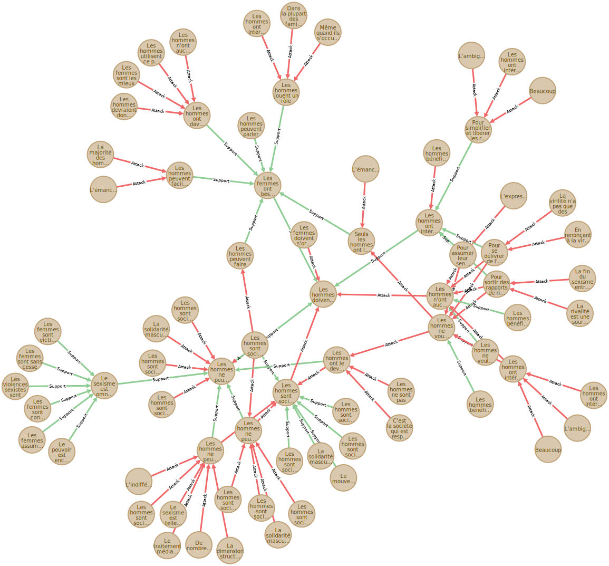
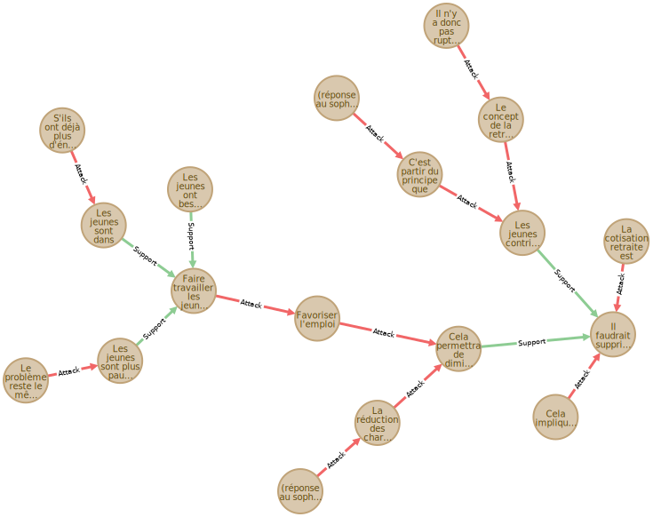
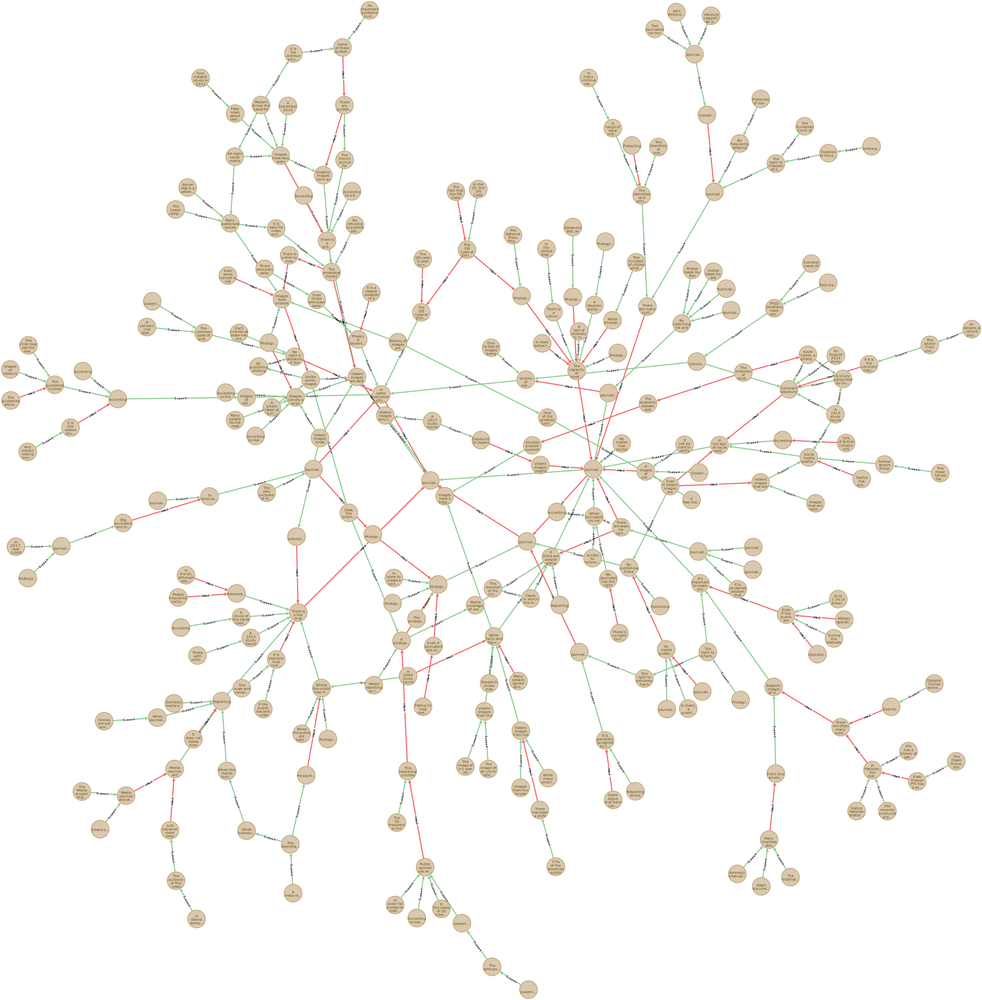

# Extraction

## Usage

Le contenu de ce dossier permet d'extraire le graphe d'argumentation de :

 - Wikidebats (fr)
 - Argüman (fr|en|es|pl|tr|ch)
 - Kialo (en)

Et de l'insérer dans une base de données Neo4j.

Pour cela, on utilise le script *extract.sh*, ou simplement le Makefile (après avoir modifié les paramètres dans *Makefile_settings.txt*)

	# Download all and insert in Neo4j DB
	make
	
	# Just download
	make download

Le script *extract.sh* a la signature suivante:

	extract.sh site [language] [--n_threads n] [--clean]

	# site: in { wikidebats | wd | kialo | kl | arguman | am }
	# language: in { fr | en | es | pl | tr | ch } (arguman only)
	# --n_threads n: download and convert n files in parallel
	# --clean: check and remove incomplete files

Cela produit deux fichiers *xxx_nodes.csv* et *xxx_edges.csv* représentant le graphe, et les instructions d'insertion cypher *xxx_insertion.cql*.

Ces fichiers csv doivent être copiés dans le dossier *import* de la base de données Neo4j avant d'exécuter les instructions d'insetion.

## Description

### Modèle(s)

On considère que les débats, prémisses, conclusions, objections, etc. sont tous des *sentences* au sens large.

Le graphe des *sentences* est un graphe étiqueté :

 - Les sommets ont un *label* (le titre de la *sentence*), une description éventuelle (le texte) et une *url* (pour les besoins de l'extraction)
 - Les arcs représentent les relations PRO (*resp.* CONS) et ont un poids égal à 1 (*resp. -1).

### Procedure

1. On parse les pages du site de façon à construire des fichiers *xxx.csv* contenant les lignes *a1;b1;c1*, *a2;b2;c2*, etc. Cela signifie que la conclusion *xxx* à pour parents les prémisses d'url *ai*, de label *bi* avec un poids *ci*.  
Ces fichiers ont en en-tête des lignes de commentaire *#url, #domain, #name* et *#description*.
2. On regroupe les fichiers produits en deux csv *nodes.csv* et *edges.csv* contenant tout le graphe.
3. On génère les instructions neo4j.

## Interrogation et visualisation

On peut utiliser le navigateur neo4j pour interroger et visualiser les données. On fait rapidement ces constats :

 - **WikiDebats**
     - Deux cycles (sentences qui s'attaquent mutuellement)
     - Arguments qui appartiennent à plusieurs débats
 - **Argüman**
     - Peu de données (principalement en chinois)
     - Uniquement de arbres (chaque prémisse à 0 ou 1 conclusion)
  - **Kialo**
     - Beaucoup de données (grands graphes: le plus grands possède 16644 sommets)

#### Galerie

	// WikiDebats (debat 44)
	MATCH
		(x)-[*0..]->(y) 
	WHERE
		y.origin="wd" and y.n=44
	RETURN
		x
	  

	// Argüman: le plus grand graphe (argüman fr)
	MATCH
		(x)-[*0..]->(y) 
	WHERE
		y.origin="am-fr" and y.n=3 
	RETURN
		x

	// Kialo: un "petit" graphe
	MATCH
		(x)-[*0..]->(y) 
	WHERE
		y.origin="kl" and y.n=19 
	RETURN
		x

