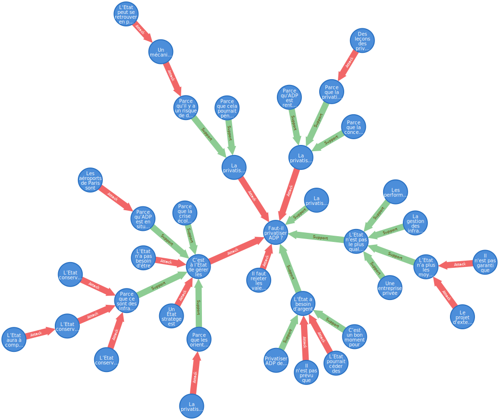
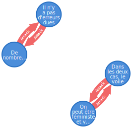
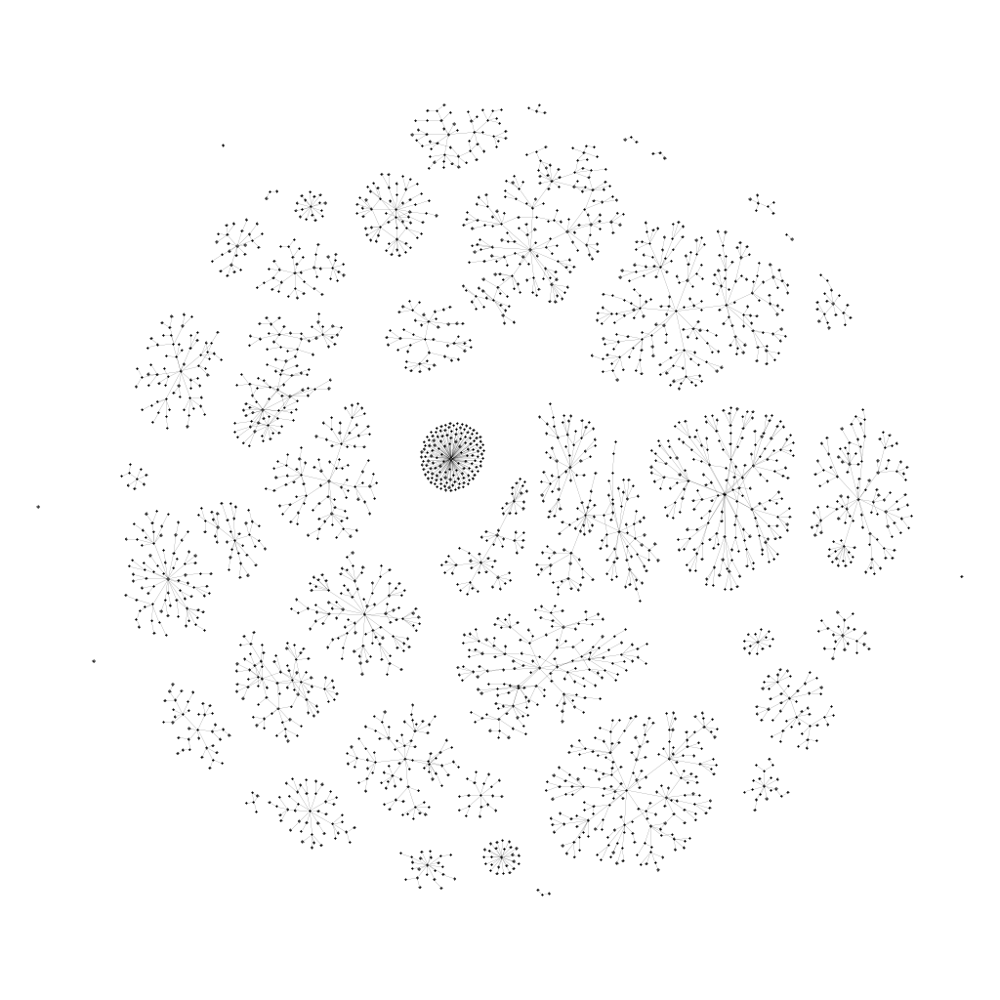

# Extraction

## Usage

Le contenu de ce dossier permet d'extraire le graphe d'argumentation de :

 - Wikidebats (fr)
 - Argüman (fr|en|es|pl|tr|ch)
 - Kialo (en)

Pour cela, on utilise le script *extract.sh*

	extract.sh site [language] [--n_threads n] [--clean]

	# site: in { wikidebats | wd | kialo | kl | arguman | am }
	# language: in { fr | en | es | pl | tr | ch } (arguman only)
	# --n_threads n: download and convert n files in parallel
	# --clean: check and remove incomplete files

Cela produit deux fichiers *xxx_nodes.csv* et *xxx_edges.csv* représentant le graphe, et les instructions d'insertion cypher *xxx_insertion.cql*.

Ces fichiers csv doivent être copiés dans le dossier *import* de la base de données Neo4j avant d'exécuter les instructions d'insetion.

## Description

### Modèle(s)

On considère que les débats, arguments, sous-arguments, objections, etc. sont tous des arguments au sens large.

Le graphe d'argumentation est un graphe étiqueté :

 - Les sommets ont un *label* (le titre de l'argument), une description éventuelle (le texte de l'argument) et une *url* (pour les besoins de l'extraction)
 - Les arcs représentent les relations de soutien (*resp.* d'attaque) ont un poids égal à 1 (*resp. -1).

### Procedure

1. On parse les pages du site de façon à construire des fichiers *xxx.csv* contenant les lignes *a1;b1;c1*, *a2;b2;c2*, etc. Cela signifie que l'argument *xxx* à pour parents les arguments d'url *ai*, de label *bi* avec un poids *ci*.  
Ces fichiers ont en en-tête des lignes de commentaire *#url, #domain, #name* et *#description*.
2. On regroupe les fichiers produits en deux csv *nodes.csv* et *edges.csv* contenant tout le graphe.
3. On génère les instructions neo4j.

C'est ce que fait *extract.sh*. Ainsi, pour tout télécharger :

	# Neo4j database directory
	db_dir=path/to/neo4j/database/directory

	# WikiDebats
	./extract.sh wd --n_threads 8
	
	# Kialo
	./extract.sh kl --n_threads 8
	
	# Argüman (foreach language)
	for lg in fr en es pl tr ch
	do
		./extract am $lg --n_threads 8
	done
	
	# Copy data to neo4j DB directory
	cp *_nodes.csv *_edges.csv $db_dir/import
	
	# Concatenate all insertion instructions
	cat *_insertion.cql > all_insertion.cql

Il ne reste plus qu'à exécuter le script *all_insertion.csv*

## Interrogation et visualisation

	// Get debate list (nodes without outgoing edges)
	MATCH (a:Argument {origin:"wd"}) WHERE NOT (a)-[]->(:Argument) 
		  RETURN a.n, a.label

	//a.n	a.label
	//17	"Faut-il supprimer les notes à l'école ?"
	//158	"Faut-il préserver les Murs à pêches de Montreuil ?"
	//159	""
	//160	"Le réchauffement climatique est-il dû à l'activité humaine ?"
	//161	"Faut-il arrêter de manger des animaux ?"
	//162	"Faut-il instaurer un revenu de base ?"
	//163	"Faut-il instaurer un salaire à vie ?"
	//[...]

	// Get the #192 debate
	MATCH (a:Argument)-[*]->(b:Argument {n: 192, origin: "wd"})
	  RETURN a, b
	  

Le système de requêtage permet aussi de détecter des problèmes dans le graphe d'argumentation.

	// Cycles
	MATCH (n)-[*]->(m) WHERE n = m RETURN n, m

### Gephi

Gephi permet la visualisation de la totalité du graphe.

Spatialisation (OpenOrd + Yifan Hu proportionnel) du graphe non pondéré (tous les arcs sont de poids égal à 1)

