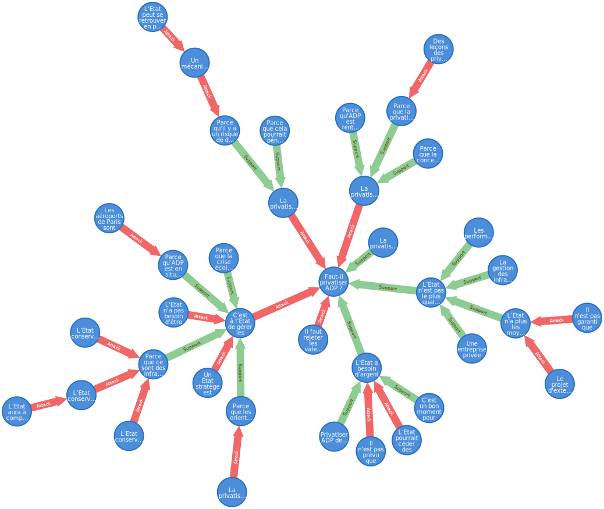
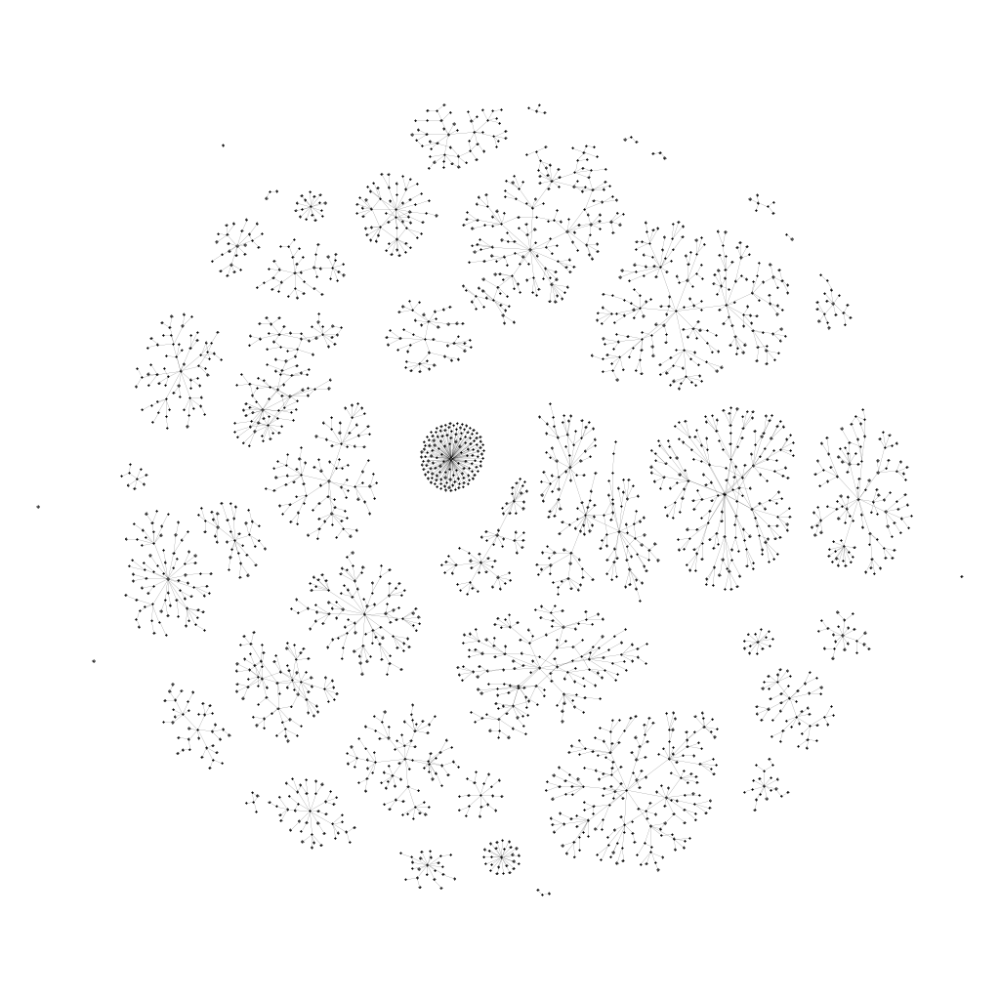

# Extraction des arguments

*Note :* Il s'agit d'une version *brouillon* incomplète. Particulièrement, on ne récupère pas le texte et autres données attachés à l'argument.

## Modèle

On cherche à reproduire le graph *(V,E)* des arguments de Wikidébats, où *V* est l'ensemble des arguments (représentés par leurs identifiants+labels), et *E* l'ensemble des liens *(u,v,w)* reliant les arguments *u* et *v* avec un poids *w* (égal à 1 ou -1).

On considère que les débats, arguments, sous-arguments, objections, etc. sont tous des arguments au sens large.

Les pages de Wikidébats forment le graphe, les liens html représentent les arcs entrants de chaque argument.

## Procédure (Wikidebats)

 1. On télécharge et simplifie les pages de façon à ne garder que la structure du graphe
 2. On parse cette structure pour reconstruire les ensembles *V* et *E*, avec la représentation voulue

### Simplification des pages

On a trois cas :

1. Les débats sont les puits du graphe, ils ont une page dédiée, accessible depuis la *sitemap*.
2. Les arguments et sous-arguments étayés sont les sommets intermédiaires, ils ont une page dédiée accessible depuis l'argument enfant.
3. Les arguments non-étayés sont les sources du graphe, ils n'ont pas de page dédiée et sont représentés uniquement dans la page de l'argument enfant.

On va transformer chaque page en un fichier *xxx.csv* contenant les lignes *a1;b1;c1*, *a2;b2;c2*, etc. Cela signifie que l'argument d'identifiant *xxx* à pour parents les arguments d'identifiant *ai*, de label *bi* avec un poids *ci*.

On parse le html de la *sitemap* facilement avec XSLT.

	mkdir out

	wget "https://wikidebats.org/wiki/Cat%C3%A9gorie:D%C3%A9bats" -O - | xsltproc xslt/sitemap.xsl - | sed 's/.wiki.//' > out/sitemap.csv

On parse ensuite le html des pages de débat avec une seconde feuille de style XSLT. Leurs urls forment la première colonne du CSV.

	urls=`cat out/sitemap.csv | cut -d ';' -f 1`
	for url in $urls; 
	do 
		echo $url; 
		wget -q "https://wikidebats.org/wiki/$url" -O - | xsltproc xslt/page.xsl - | sed 's/.wiki.//' > "out/$url.csv"; 
	done

On a ainsi parsé les arguments de niveau 1. Les pages des arguments intermédiaires ont la même structure que les pages de débats, on peut donc appliquer récursivement cette feuille de style (exactement: tant qu'on extrait de nouveaux arguments).

*Note :* L'étape précédente est facultative, car elle constitue la première itération cette boucle.

	n_files1=0
	n_files2=`ls out/ | wc -w`

	while test $n_files1 -ne $n_files2
	do 
		urls=`cat out/*.csv | cut -d ';' -f 1`
		for url in $urls
			do 
			if test ! -f out/$url.csv
			then
				echo "$url"
				wget -q "https://wikidebats.org/wiki/$url" -O - | xsltproc xslt/page.xsl - | sed 's/.wiki.//' | tr '/' '~' > "out/`echo "$url" | tr '/' '~'`.csv"
			fi
		done
		n_files1=$n_files2
		n_files2=`ls out/ | wc -w`
	done
	
*Note :* On convertit les */* en *~* pour les noms de fichiers.

*Note :* le script génère quelques erreurs dues aux pages invalides, mais n'impacte pas le parsing.

Nous avons maintenant une collection de fichiers CSV représentant le graphe, chaque fichier *xxx.csv* contenant les liens entrants du sommet *xxx*.

### Reconstruction du graphe

On utilise ensuite un script *python* pour reconstruire le graphe. On peut générer des csvs pour *neo4j* ou pour *gephi*.

	python3 mk_graph.py

Cela génère les deux fichiers *n4j_nodes.csv* et *n4j_edges.csv* qu'on peut importer directement avec neo4j, après les avoir copié dans le dossier *import/* de la base.

	// Create nodes
	LOAD CSV WITH HEADERS FROM "file:///n4j_nodes.csv" AS row
	  CREATE (:Argument {url: row.url, label: row.label, n: toInteger(row.n)})
	  
	// Create index on 'n' attribute
	CREATE INDEX ON :Argument(n)
	
	// Create 'Support' edges
	LOAD CSV WITH HEADERS FROM "file:///n4j_edges.csv" AS row
	  WITH row WHERE toInteger(row.weight) > 0
	  MATCH (n1:Argument {n: toInteger(row.n1)}),
	    (n2:Argument {n: toInteger(row.n2)})
	  WITH row, n1, n2
	  CREATE (n1)-[:Support {w: toInteger(row.weight)}]->(n2)

	// Create 'Attack' edges
	LOAD CSV WITH HEADERS FROM "file:///n4j_edges.csv" AS row
	  WITH row WHERE toInteger(row.weight) < 0
	  MATCH (n1:Argument {n: toInteger(row.n1)}),
	    (n2:Argument {n: toInteger(row.n2)})
	  WITH row, n1, n2
	  CREATE (n1)-[:Attack {w: toInteger(row.weight)}]->(n2)

## Résultats

Querying (neo4j) :

	// Get debate list (nodes without outgoing edges)
	MATCH (a:Argument) WHERE NOT (a)-[]->(:Argument) 
		  RETURN a.n, a.label

	//a.n	a.label
	//17	"Faut-il supprimer les notes à l'école ?"
	//158	"Faut-il préserver les Murs à pêches de Montreuil ?"
	//159	""
	//160	"Le réchauffement climatique est-il dû à l'activité humaine ?"
	//161	"Faut-il arrêter de manger des animaux ?"
	//162	"Faut-il instaurer un revenu de base ?"
	//163	"Faut-il instaurer un salaire à vie ?"
	//[...]

Visualisation (neo4j) :

	// Get the #192 debate
	MATCH (a:Argument)-[*]->(b:Argument {n: 192})
	  RETURN a, b

Visualisation (Gephi) :

	# Gephi want 'source' and 'target' columns, and doesn't like negative or null weight values
	cat n4j_edges.csv | sed 's/n1/source/' | sed 's/n2/target/' | sed 's/-1/1/' > edges2.csv
	
Ouverture avec Gephi, puis spatialisation (OpenOrd + Yifan Hu proportionnel) :

